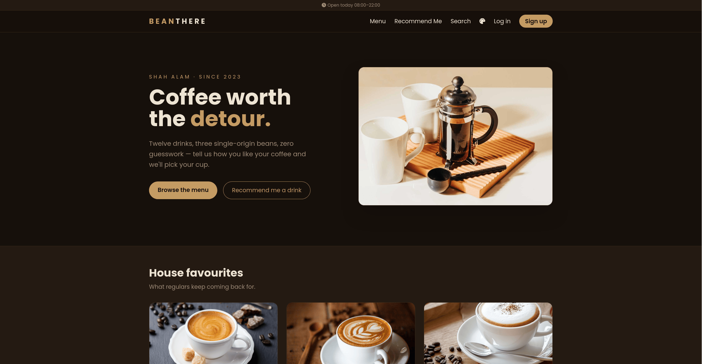
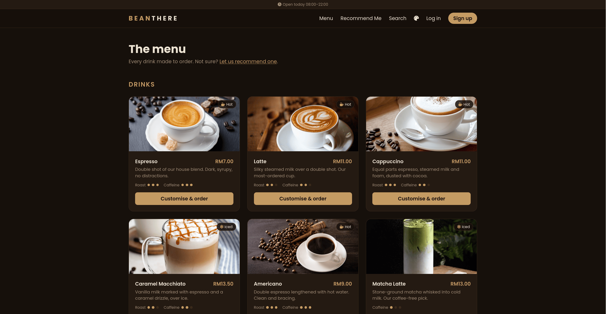
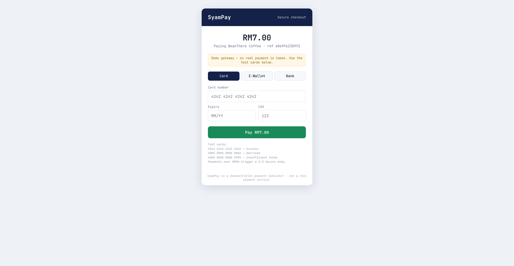
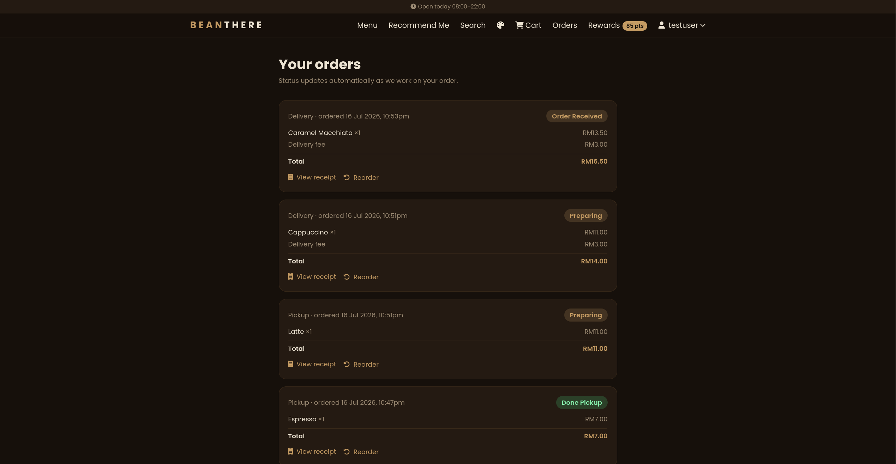
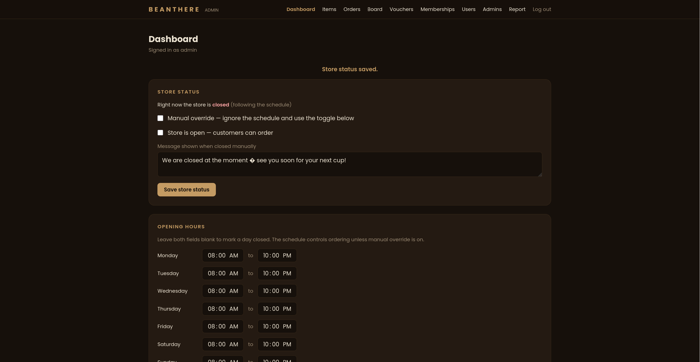
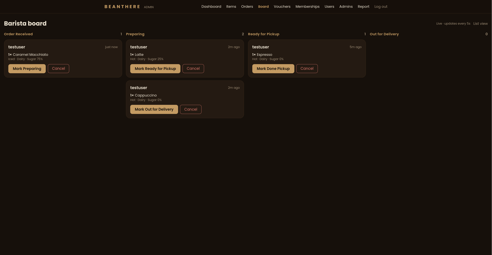
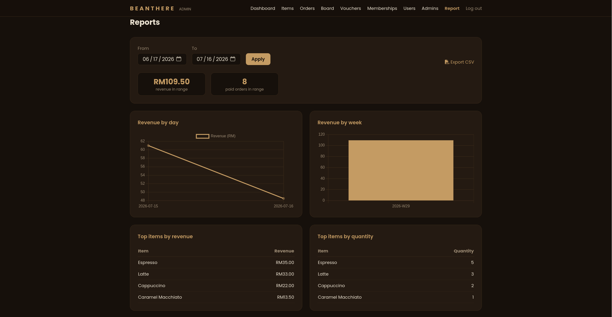
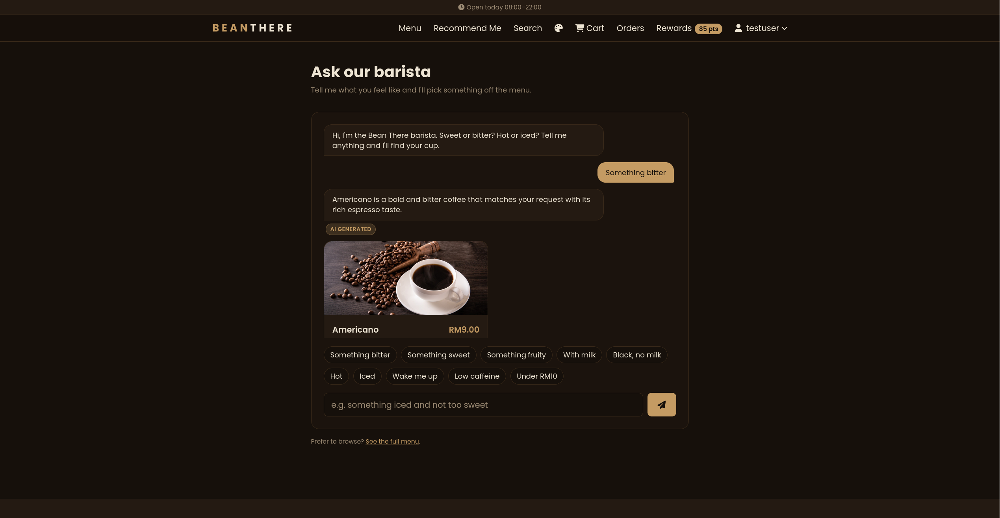
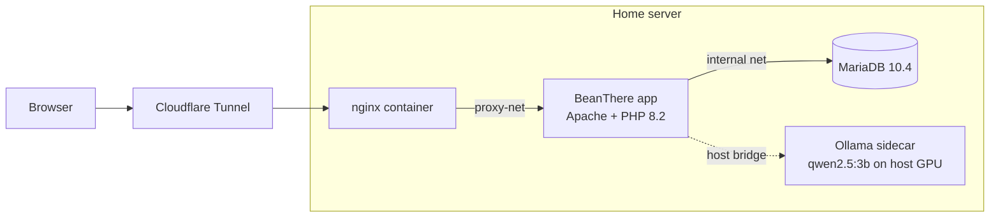

# BeanThere ☕

A coffee shop web app with online ordering, loyalty rewards, an AI drink
recommender, and a full DevSecOps pipeline — built as a portfolio project in
plain PHP, deployed on a self-hosted home server.

**Live demo:** https://beanthere.syamxm.com


> This is a demo — no real money moves and no messages are sent.
> See [Demo limitations](#demo-limitations).

## Screenshots


















## Why I built this

I built BeanThere to demonstrate real engineering practice end to end, not
just a CRUD demo: a full-stack PHP app with genuine security hardening
(CSRF, rate limiting, prepared statements everywhere), a six-gate DevSecOps
CI/CD pipeline, and a local LLM chatbot running on constrained hardware
(a 4 GB VRAM GPU). Everything is self-hosted — Docker, nginx, Cloudflare
Tunnel — on my own home server.

## Feature highlights

- **Online ordering** — browse the menu, customize drinks, cart, checkout
  with a simulated payment gateway that has real failure paths (declines,
  expiry, 3-D Secure over RM50).
- **Order tracking** — live status updates with a browser ping when your
  order is ready.
- **Barista board** — a counter-tablet view for staff: live order cards in
  columns, safe against double-taps and stale tabs.
- **Loyalty program** — points on every paid order, tier multipliers,
  monthly member vouchers, and point-redeemable reward vouchers.
- **AI drink recommender** — a chatbot backed by a local Ollama model, with
  a rule-based fallback so it always answers even when the model is down.
- **Admin tools** — menu and stock management, order management, opening
  hours schedule, analytics with CSV export.

## Architecture



HTTPS terminates at Cloudflare; no host port is exposed publicly. Cron jobs
on the host advance demo orders and grant monthly vouchers. Full details in
[docs/ARCHITECTURE.md](docs/ARCHITECTURE.md).

## Tech stack

| Layer | Choice |
|-------|--------|
| Backend | PHP 8.2 (no framework), Apache |
| Database | MariaDB 10.4 |
| Frontend | Tailwind CSS (compiled at image build), vanilla JS, Chart.js (self-hosted) |
| AI | Ollama (`qwen2.5:3b-instruct`) on the host GPU, rule-based fallback |
| Infra | Docker Compose, nginx reverse proxy, Cloudflare Tunnel |
| CI/CD | GitHub Actions → Tailscale SSH deploy to home server |

## Security & DevSecOps

The pipeline and hardening are the point of this project. Highlights:

- **CSRF tokens** on every state-changing POST.
- **Prepared statements** for every query — no string interpolation of
  request input into SQL anywhere.
- **bcrypt** password hashing with automatic re-hash on login when PHP's
  default cost moves on.
- **Rate limiting** on login (per username+IP and per IP), sign-up, and the
  chatbot — over the chat limit you still get an answer, just from the
  rule-based path.
- **Strict security headers** — CSP with `default-src 'self'` (the site
  makes zero third-party requests), nosniff, frame denial.
- **Hardened PHP** — errors to container logs only, strict session cookies,
  session ID regeneration on login.
- **Six-gate CI pipeline** — every push must pass:

```
lint ──┐
       ├──▶ build ──▶ trivy fs + image ──▶ (merge) ──▶ deploy
semgrep┘
gitleaks (parallel, plus a weekly full-history scan)
```

  `php -l` lint → Semgrep static analysis → gitleaks secret scan → Docker
  build → Trivy misconfiguration and CVE scans → deploy over Tailscale SSH,
  which only fires when CI on `main` is green.

Full writeup: [docs/SECURITY.md](docs/SECURITY.md).

## Quick start

Everything runs in Docker — you only need Docker and Git, on Linux, Windows,
or macOS. A local run is fully separate from the live site.

```bash
git clone https://github.com/syamxm/BeanThere.git
cd BeanThere

# One-time: the compose file expects this external network to exist
docker network create proxy-net

cp .env.example .env    # Windows PowerShell: copy .env.example .env
```

Open `.env` and set values for `DB_PASS`, `DB_ROOT_PASS`, and
`PAYMENT_SECRET` (any values work locally — they just need to exist; use a
long random string for `PAYMENT_SECRET`). Leave `OLLAMA_URL` as-is — without
a local Ollama the chatbot simply uses its rule-based fallback. Never commit
`.env`; it is git-ignored.

```bash
docker compose up -d --build
```

Then open **http://127.0.0.1:8081**, register an account, order a drink, and
check out with test card `4242 4242 4242 4242` (nothing real is charged).

| Action | Command |
|--------|---------|
| Start (after first setup) | `docker compose up -d` |
| View logs | `docker compose logs -f app` |
| Rebuild after code changes | `docker compose up -d --build` |
| Stop | `docker compose down` |
| Reset the local database | `docker compose down -v` |

<details>
<summary>Windows gotchas & first-boot notes</summary>

- **Docker Desktop must be running** (whale icon in the tray) before any
  `docker` command — otherwise you get `error during connect`.
- **WSL 2 is required.** If Docker Desktop complains, run `wsl --install` in
  an Administrator PowerShell and reboot.
- If `docker network create proxy-net` says the network already exists,
  that's fine — skip it.
- The database imports `db/coffeebuddydb.sql` on first boot only. Seeded
  accounts (`admin`, `testuser`) have no working password by default — see
  the comment block at the bottom of that file to set one.
- To try the chatbot's AI path locally, stand up Ollama on your machine —
  see [docs/ARCHITECTURE.md](docs/ARCHITECTURE.md#ollama-setup).

</details>

## Deep dives

- [docs/ARCHITECTURE.md](docs/ARCHITECTURE.md) — payment flow internals,
  orders and the barista board, cron jobs, data integrity, analytics,
  opening hours, deployment topology, Ollama setup.
- [docs/SECURITY.md](docs/SECURITY.md) — the full security model and the
  CI/CD pipeline, gate by gate.

## Demo limitations

- **Payment** is simulated by "SyamPay", a self-contained pretend gateway
  with test cards, Luhn checks, and a fake 3-D Secure step. No real money
  moves; every page says so.
- **Account verification** sends no OTP or email — choosing a method marks
  the account verified instantly, labeled "Demo" in the UI.

---

Built by [syamxm](https://github.com/syamxm) · Live at
[beanthere.syamxm.com](https://beanthere.syamxm.com)
